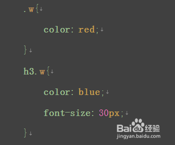
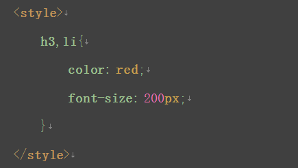
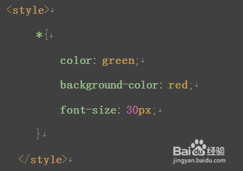
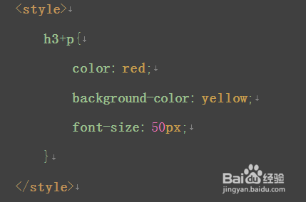

#### :smiling_imp: 8月-10月 开发日志汇总

------------

*2018年8月15日21:47:13*

开发记录:
1. 谷歌浏览器支持8位hex表示颜色，前六位为颜色，后两位为透明度 范围四00-ff 即0-255的alpha透明度
2. cdkeys对应了secretID，激活该密钥自动添加到对应主人名下的devices表中（放弃该想法，还是首次认证加入输入密钥）
3. 用户权限等级分为三等：
1：普通用户，允许使用自助面板
2：中级管理员，可以访问后台面板，产生和获取cdkey
3：顶级管理员，可以授予其他用户权限，以及上述功能

------------


*2018年8月16日*
1. 
`<a href="javascript:void(0)" onclick="load(this)">`
a标签这样可以无刷新执行脚本
`document.getElementById("si").value=obj.text; ` 
把标签文本（obj.text）提取出来了

2. 
因为认证原理，隐藏secretID是不应该暴露的，但是为了让用户记住设备，多一项origin_license记录初始授权码

3. 
更换设备设计：同时更新last_license和origin_license
因而暴露给用户，新的license可以用于更换认证
同时脚本客户端设置策略，对两种初始认证分支判断：
1.通过授权码首次激活设备 2.通过暴露出来的origin_license
用户仅输入授权码完成更换认证（更换认证和auth认证相同）
和auth相同的原理在于，auth是通过隐藏si数据传递认证，
更换认证，在于传递授权码作为si进行认证，最终要求结果都
一致，即更换隐藏si，实现后续持续认证使用。
同时也解决了企图克隆授权设备获取盗版的难题，只要每次使用隐藏域si不停更换那么克隆就是没有意义的

4. 
客户端接口加密token算法简化了，没有使用时间加盐算法，
只是简单地额外字符串和参数拼接，为什么呢？不需要时间混淆，要从破解者说起，破解者频繁访问接口并抓包，分析token的特征，如果接口参数单一无变化，那么token算法加上时间是很重要的，避免被推测进而重放攻击。但是我的认证本身就包含变化的si值，虽然si值最终会因为抓包暴露，但是由于自己加入了特征字符串，再加上md5加密，攻击方也无从计算token值，所以简化也没有什么问题

5. 值得说明的是，第四点说的si暴露，的确有隐患，返回信息被拦截后，新si就会被套出，用于新的设备临时认证（只要不重启，就可以实现伪破解：同时使用软件），更大的同样原理问题是拦截模拟发送200成功码，即可绕过认证，所以客户端在通信时，要对数据包进行加密，比如不走http协议，加强抓包难度，通信内容进行混合加密解密

------------

*2018年8月25日2309*
1. mysql函数
`DATE_SUB()` 函数从日期减去指定的时间间隔。

> 语法 
> DATE_SUB(date,INTERVAL expr type)

------------

*2018年8月28日2309*

1. 很晚了。。。总结今天前端学习
关于position的relative和fixed都是利用固定页面边距设置如，`left=XX `
如果使用浮动的话`float:right`,我想这样把菜单靠右设置，需要自己根据trigger的宽度在margin上
减去，否则会溢出，简单计算下即可，
	- 	absolute	
	生成绝对定位的元素，相对于 static 定位以外的第一个父元素进行定位。
	元素的位置通过 "left", "top", "right" 以及 "bottom" 属性进行规定。
	- 	fixed	
	生成绝对定位的元素，相对于浏览器窗口进行定位。
	元素的位置通过 "left", "top", "right" 以及 "bottom" 属性进行规定。
	- 	relative	
	生成相对定位的元素，相对于其正常位置进行定位。
	因此，"left:20" 会向元素的 LEFT 位置添加 20 像素。
	
2. 除此外还有background设置为透明transparent时候，注意每个情况兼顾，只有颜色透明度统一
才会美观，改天有机会学习下，贴矩形三角形对话框气泡如何通过css表示出来

以上就是今天对固定悬浮遮挡div的学习，主要是对多种定位方式的控制

------------

*2018年9月7日*
1. 	后代选择器：中间用空格隔开，作用是把某一部分的所有进行样式改变，如图
 
2. 	交集选择器：中间是英文的“.”作用是同时满足两个条件
 
3.	并集选择器：中间用英文逗号“，”隔开，表示两个或者两个以上的元素共用一个元素
 
4.	通配符：形式是*{}   选择的是页面中的所有元素，但是效率不高。
 
5.	子代选择器：中间是“>”隔开，只能运用在“父子级”的元素标签中。
 
6.	下一个兄弟选择器：中间用“+”隔开，选择的是某个元素后面紧跟着的那个元素
 

------------

*2018年9月27日0306*

1. 今天学习爬取一个网站变为中文站
遇到问题许多图像调度都是通过js操作 dom实现的修改img的orgin
以及x,Y值实现的一个纸娃娃制作系统，其余js和css文件不需要爬取，主要就是一些js加载的图片不好爬取
2. 经过研究发现，只要把触发js的事件响应过，那么对于素材就会加载上去，现在便有了两种思路
 - 根据网页源码分析提取文件名，结合js函数，推断出它的url，这个方法比较复杂，因为该系统换装类目就有10多项，费时费力
 - 通过console，操作dom每个都模拟点击下（当然python之类也有操作库），经过发现console控制台用js制服js是最简单的，于是先引入jquery，（js比较繁琐），
	- 注意1：引入的话是不能直接修改Elements的，因为浏览器对于js引入已经结束了，载入了缓存，修改elements最多改变渲染画面了, 所以在console输入
```javascript
var importJs=document.createElement('script') //在页面新建一个script标签`
importJs.setAttribute("type","text/javascript") //给script标签增加type属性
importJs.setAttribute("src", 'http://ajax.microsoft.com/ajax/jquery/jquery-1.4.min.js')//给script标签增加
document.getElementsByTagName("head")[0].appendChild(importJs)
```
就是往缓存里强行加入jquery，加入好了。我们开始触发
`$("span").click();`
看下源码啊，换装按钮都是span标签带的onclick属性触发的，所以↑即可全部click

    -  注意2：但是这样做后并没有大用，看来js载入机制，会把换装按钮全  部点击完然后才开始响应事件驱动，不，并不是这样
其实click事件已经响应了，但是origin最后不停替换，中途并不会停下来给你渲染，只有所有js完毕后才会渲染，于是
每次都只是换装最后一个样式图片，无法加载所有图形便无法爬取url，
这里又有了分支方案，1：将错就错，每次修改完后读取该按钮修改的img标签属性，并保存下来
3.  想办法异步执行，解决这个js运行机制带来的问题
于是我采用方案2
```javascript
var i=0;
$("span").each(
function(){
	i+=1;
	var t=$(this);
	setTimeout(function () {
			t.click();
			console.log(t);
	}, 2000);
}
);
```
&nbsp;&nbsp;&nbsp;&nbsp;&nbsp;&nbsp;&nbsp;一开始并没有setTimeout,失败了，原因就是之前那个，for循环没有本质解决非异步的问题，
于是加入了setTimeout,这个是js里很经典的异步方法，多少ms后才会执行语句，循环加上setTimeout是很自然的想法，但是js这里的循环却是
非阻塞的，他会一次性执行完毕，不会因为内部的异步方法而停止阻塞，甚至，虽然不在我们今天讨论范围内，后续的函数也会先执行完才会开始 setTimeout的队列，如图
后来又了解到了闭包的概念，js中的闭包在一定情况下可以解决循环内延迟方法这种矛盾做法想要解决的问题
又了解到了函数回调的概念，简单引用下别人的介绍
后来，观察一番，使用函数结合异步延迟队列即可解决问题，代码如下


```javascript
var i=$("span").length;
function xilou(){
	i-=1;
	$("span")[$("span").length-i-1].click();
	console.log(i);
	if(i<=0) return;
	setTimeout(xilou,400);
}
xilou();
```


完美解决，400ms换一次装，总共更换2800张图片，全部载入开发者内的Sources下的Page面板，一览无余，但是这里却没有很好的办法整个保存出来，
这时候使用Network 的Save All功能，简单筛选一番，即可把下载链接批量保存,再用WINHTTrack把链接按目录形式下载，就把关键的换装图片全部爬下来了。
虽然这次只是下载一个小小的静态整站，但也很吃力呢!
后记：还有一种方法
```javascript
          setTimeout(function() {
              for (var i = 0; i < 100000; i++) {
              console.log(i)
              }
          }, 0);
```


详见	[https://neteen.online/rpgmaker/looseleaf/](https://neteen.online/rpgmaker/looseleaf/)

------------

*2018年9月28日*

1. 
今天对旧知识又遗忘了，
如果要高度自适应，那么，可以height设置默认的auto
会根据文档流内父级div内高度累计获取auto高度，如果子类div是fixed，absolute
这一类定位或者float这种布局，那么height是不会算进去的，如果你设置了overflow为hidden
那么，是显示不出来的，overflow引入需要把父级height固定为一个较大值，但是今天我这里的
导航菜单，本身就是脱离文档流的absolute的nav，
它是给溢出元素隐藏的，既然我们已经脱离出去了，那么overflow设置为hidden毫无意义，
于是把父级height取消，不取消呢？那么一个隐藏域会阻碍下层页面操作，因为z-index大于
其他元素。
	- 一，重新对position进行理解：
		- 默认static位置对于top，bottom,left,right属性自动屏蔽，属于文档流，无法此类定位
		- fixed，对于窗口来说已经固定了，是漂浮在屏幕上的ghost，脱离了文档流
		- relative，相对布局，加入之后可以基于正常文档流位置进行偏移设置，如top,left....
		- absolute,绝对布局，从正常文档流中脱离，不过有几个规则
	1. 如果对四大属性top，bottom,left,right，对没有指定的属性将自动沿用该元素正常文档流里位置，如沿用父元素左上角作为起点
	2. relative是它的限制框架（absolute也只能在父级relative范围内移动）
	3. 设置后自动变为inline-block对象

定位机制分为，文档流，浮动和绝对定位
二·对display理解
1. float:浮动样式，脱离文档流，悬浮位置于上一个非float元素的下面作为起点，后续非float元素会自动补位，被float元素遮住

2. inline inline一类元素都同行显示，溢出才会换行，无法设置高度宽度，margin padding只有左右边距有效，上下无效。
	作用：把表格切换为横向作为菜单
	
3. block 阻碍式格局，一定换行，如div，默认宽度100%

4. inline-block  翻一下就是内联的block对象，在一行的block，可以设置宽高属性
内联不能嵌套块级元素，反之可以


------------

*时间2018年9月29日02*
### **[project1项目完善](../project1/ "project1项目完善")**

1. 瞳孔坐标减去镜框中心坐标就是镜框起点坐标
0.235x 0.544y -x0 y0
改进之后更稳定了，之前an这个写法中间有点问题，这次终于无错误写出来了
加上y和x轴合乎人类的偏移，让镜框保留在了眉下，鼻梁间

```javascript
/////////////////代码测试区/////////////////////////////


 let image = cv.imread('canvasOutput');//镜架
  let hand = cv.imread('canvasInput2');//镜架黑膜
  let mask = cv.imread('canvasInput2',0);
  let handok = new cv.Mat();
  let maskok = new cv.Mat();
//cv.resize (hand, handok,dsize , 0, 0, cv.INTER_LINEAR);
//cv.resize(mask, maskok, dsize , 0, 0, cv.INTER_LINEAR);
cv.imshow('canvas3', hand);
cv.imshow('canvas4', mask);
  image = cv.imread('canvasInput');
   hand = cv.imread('canvas3');
   mask = cv.imread('canvas4',0);
///////////////////////////////////////////////////////
//utils.loadImageToCanvas('glass_1.png','canvasOutput');
//utils.loadImageToCanvas('glass_1.png','canvasInput2'); //复原以进行第二次
//镜架缩放 显示 再获取读入 设置roi copyTo 展示到Input  
//-------------------------------------------------------

let src = cv.imread('canvasInput');
let gray = new cv.Mat();
cv.cvtColor(src, gray, cv.COLOR_RGBA2GRAY, 0);
let faces = new cv.RectVector();
let eyes = new cv.RectVector();
let faceCascade = new cv.CascadeClassifier();
let eyeCascade = new cv.CascadeClassifier();
// load pre-trained classifiers
faceCascade.load('haarcascade_frontalface_default.xml');
eyeCascade.load('haarcascade_eye.xml');
// detect faces
let msize = new cv.Size(0, 0);
faceCascade.detectMultiScale(gray, faces, 1.1, 3, 0, msize, msize);
for (let i = 0; i < faces.size(); ++i) {
    let eyesflag = 0;
    let roiGray = gray.roi(faces.get(i));
    let roiSrc = src.roi(faces.get(i));
    // detect eyes in face ROI
    eyeCascade.detectMultiScale(roiGray, eyes);console.log(faces.get(i));
    for (let j = 0; j < eyes.size(); ++j) {
         if(eyesflag==0)
            {    
                //每个脸最多一个眼镜，且必须首个eye位置必须在左上半区
                if(eyes.get(j).x<=faces.get(i).width/2 && eyes.get(j).y<=faces.get(i).height/2)
                   {
						let sizerate = (hand.cols/faces.get(i).width)*1.4;

						let dsize = new cv.Size(hand.cols / sizerate, hand.rows / sizerate);
						cv.resize (hand, handok,dsize , 0, 0, cv.INTER_LINEAR);
						cv.resize(mask, maskok, dsize , 0, 0, cv.INTER_LINEAR);

console.log(new cv.Point(faces.get(i).x+eyes.get(j).x+eyes.get(j).width*0.5,eyes.get(j).y+faces.get(i).y+eyes.get(j).height*0.7));
                   imageROI = image.roi(new cv.Rect(faces.get(i).x+eyes.get(j).x+eyes.get(j).width/2-0.223*handok.cols,eyes.get(j).y+faces.get(i).y+eyes.get(j).height*0.75-0.537*handok.rows,handok.cols, handok.rows));
                      handok.copyTo(imageROI,maskok);
                      eyesflag+=1;
                    }
             } 
    }
    roiGray.delete(); roiSrc.delete();
}
///////////////////////////////////////////////////////////
   for (let j = 0; j < eyes.size(); ++j) {
   }
  
cv.imshow('canvas5', image);
////////////////////////////补充
src.delete(); gray.delete(); faceCascade.delete();
eyeCascade.delete(); faces.delete(); eyes.delete();
image.delete();hand.delete();mask.delete();handok.delete();
maskok.delete();
```


------------
:kissing_closed_eyes:
#### 时间很快就会这些随笔记忆吞噬，特此整理供日后反思
------------


`开发日志`-`2018年8月-10月`